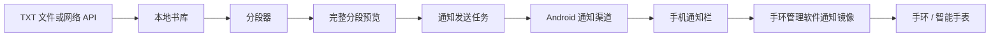

# 手环通知小说 / Band Novel Reader

> **中文**：一个将 TXT 小说按可控字数切分，并通过 Android 系统通知逐段推送到手机与手环的 Flutter 应用。  
> **English**: A Flutter Android application that splits TXT novels into controllable segments and delivers each segment through Android notifications to a phone and its paired smart band/watch.

[](LICENSE)
[](https://www.android.com/)
[](https://flutter.dev/)

## 中文说明

### 项目简介

**手环通知小说**适用于希望利用手环通知阅读短段文本的用户。它不会把整本小说压缩成一条摘要，而是将原始 TXT 正文按设定的字符数分段，把每一段**完整文本**以 Android 大文本通知形式送出。手机系统将通知镜像到已授权的手环后，用户便可在手环上查看对应段落。

本项目是一个 Android 优先的 Flutter 应用，包名为 `com.ritualcollapse.wristnovel`。它支持本地 TXT 文件和网络 API 两种导入方式，维护多书库，允许用户预览和批量调整分段，并将书籍、设置及发送进度保存在设备本地。

> **重要提示**：手机端的 Android 通知权限与手环管理软件中的“应用通知／应用提醒／通知同步”是两层独立设置。即使手机已经允许本应用发送通知，也必须在手环配套管理软件中找到“手环通知小说”并开启通知镜像，手环才能收到内容。

### 核心功能

| 功能 | 说明 |
| --- | --- |
| 多书库 | 可导入并保存多本 TXT 图书；当前选中的图书决定预览、发送与断点续传内容。 |
| 双入口导入 | 支持系统文件选择器导入本地 TXT，也支持 HTTP/HTTPS API 下载纯文本或 JSON 图书内容。 |
| 自动书名与简介 | 从文件名解析书名，并从正文生成本地简介，无需外部元数据服务。 |
| 可控分段 | 统一每段最大字符数可设为 **20–1000**；可在预览页对指定连续区间重新分段。 |
| 完整段落预览 | 每一段均可在应用内查看；发送的通知正文与预览段落保持一致。 |
| 前台／后台发送 | 前台使用精确的 Dart 延时循环；后台使用 Android 前台服务持续尝试发送。 |
| 毫秒级间隔 | 间隔范围为 **100–3,600,000 ms**。短间隔建议在前台模式使用。 |
| 断点续传 | 图书、分段、当前段落、发送模式和发送间隔均保存到本机；暂停或重启后可继续。 |
| 通知权限引导 | 首次引导会请求 Android 系统通知权限，并提示用户同步配置手环管理软件的通知权限。 |
| 通知自检 | 主页提供测试通知与系统通知设置入口，便于验证手机与手环镜像链路。 |
| 缓存清理 | 可清理临时缓存，不会删除图书、设置或发送进度。 |

### 实现原理

#### 1. 从 TXT 或 API 到书库

本地导入通过系统文件选择器读取 `.txt` 文件的字节数据，并对常见 UTF-8／UTF-16 编码进行解码。网络导入向用户提供的 HTTP/HTTPS 地址发起请求：接口既可以直接返回纯文本，也可以返回包含 `title`／`name` 与 `content`／`text`／`body` 字段的 JSON。导入的正文、文件名、个性化分段和当前选书状态由 `shared_preferences` 持久化。

#### 2. 分段和预览

分段器根据“每段最大字符数”保留原文顺序，并在满足上限的范围内优先寻找自然边界。这样既能控制单条通知的阅读长度，又可避免在可选位置随意破坏文本。预览页显示同一组最终片段，并支持只对连续的段落区间批量重新分段。

#### 3. Android 通知发送

应用通过 `flutter_local_notifications` 创建 `novel_text_channel` 通知渠道，并为每段正文设置 Android 的大文本样式。每条通知拥有独立 ID，标题标记当前段落序号，正文携带完整分段文本。通知小图标 `app_icon` 被明确保留为 Android drawable 资源，以防发布构建的资源压缩误删运行时引用的图标。[1]



#### 4. 权限和手环通知同步

Android 13（API 33）及以上将通知作为运行时权限处理。应用在首次引导的通知步骤中，通过 Android 系统弹窗请求 `POST_NOTIFICATIONS`；如果曾经拒绝，用户可跳转到系统的应用通知设置。该权限只负责让手机系统显示通知。手环是否收到内容仍取决于相应配套管理软件是否为本应用开启“应用通知／通知同步／镜像”权限。[2]

#### 5. 前台、后台与断点恢复

前台模式对每个片段调用通知 API，再使用 `Future.delayed` 等待用户设置的毫秒间隔。后台模式使用 `flutter_foreground_task` 建立可见的 Android 前台服务，确保任务在离开应用或锁屏后仍能尝试运行；系统的节能和后台调度策略可能使极短间隔不完全精确。[3]

每次发送成功后，应用都会本地保存下一段索引。主页控制按钮始终互斥：没有未完成会话时显示“发送”，运行时显示“暂停”，暂停后显示“继续”。

### 安装与使用

1. 在 [Releases](../../releases) 页面下载所需版本的 APK，并在 Android 设备上安装。
2. 首次打开时，进入引导页并在 **Android 系统弹窗**中允许通知。
3. 打开手环配套管理软件，在“设备 / 通知 / 应用通知（或应用提醒）”中启用 **手环通知小说** 的通知同步。
4. 在应用中导入 TXT，或输入可访问的网络图书 API 地址。
5. 在设置页选择分段字符数、发送模式和发送间隔；可先进入预览页检查分段。
6. 回到主页，点击“发送”。建议先使用“发送测试通知”确认手机和手环均能收到通知。

### 运行与构建

| 项目 | 已验证环境 |
| --- | --- |
| Flutter | 3.47.1 |
| Dart | 3.13.1 |
| Android compile SDK | 36 |
| Java | 17 或更高版本 |

```bash
flutter pub get
flutter analyze
flutter test
flutter build apk --release --target-platform android-arm64
```

发布 APK 的默认输出路径为：

```text
build/app/outputs/flutter-apk/app-release.apk
```

### 全部版本与历史安装包

仓库保留从 **0.1alpha** 到当前 **2.0** 的全部历史 Android 安装包。请在 [Releases](../../releases) 页面下载所需版本，并阅读 [逐版中英文更新日志](docs/releases/RELEASE_HISTORY.md) 了解对应功能、修复和文件名称。

### 开源许可

本项目采用 [GNU General Public License v3.0](LICENSE)（GPL-3.0）发布。复制、修改和再发布本项目时，请遵守该许可证关于保留同等自由与源代码可用性的要求。

---

## English

### Overview

**Band Novel Reader** is designed for reading short pieces of novel text through smart-band notifications. Rather than reducing a chapter to a notification summary, it splits the original TXT content into configurable segments and sends the **complete text of each segment** as an Android big-text notification. Once the phone notification is mirrored by a paired wearable, the matching segment becomes visible on the band or watch.

This is an Android-first Flutter app with package ID `com.ritualcollapse.wristnovel`. It supports local TXT import and network API import, keeps a multi-book library, offers segment preview and batch adjustment, and persists books, settings, and sending progress on-device.

> **Important**: Android notification permission and the wearable companion app's app-notification/mirroring permission are separate layers. Allowing phone notifications alone is not sufficient; enable notification synchronization for **Band Novel Reader** in the companion app as well.

### How it works

| Layer | Implementation |
| --- | --- |
| Ingestion | The app decodes local TXT files or downloads plain text / JSON from an HTTP(S) API. |
| Library | Book text, file names, custom segments, selected book, settings, and resumable sessions are persisted locally. |
| Segmentation | Text is split in order with a configurable maximum of 20–1000 characters per segment, while preferring natural boundaries where possible. |
| Notification delivery | Each completed segment is sent through Android's `novel_text_channel` using a big-text notification style and a stable per-segment notification ID. |
| Permission flow | On Android 13+, onboarding triggers the system `POST_NOTIFICATIONS` runtime prompt and provides a shortcut to app notification settings after denial. |
| Wearable delivery | The phone OS posts the notification; the wearable companion app mirrors it only after the user enables this app in its notification/app-alert settings. |
| Foreground / background | Foreground mode uses a Dart delay loop. Background mode uses a visible Android foreground service and is subject to Android scheduling and battery policies. |
| Recovery | The next segment index is saved after delivery, allowing pause/resume and restart recovery. |

### Install and use

1. Download an APK from [Releases](../../releases) and install it on an Android device.
2. During onboarding, grant Android notification permission in the system dialog.
3. In the companion software for your band/watch, enable app notifications, notification mirroring, or app alerts for **Band Novel Reader**.
4. Import a TXT file or provide an accessible book API endpoint.
5. Configure segment length, delivery mode, and interval; preview segments when needed.
6. Tap **Send**. Use **Send test notification** first to verify both phone and wearable delivery.

### Build from source

```bash
flutter pub get
flutter analyze
flutter test
flutter build apk --release --target-platform android-arm64
```

### All versions and historical APKs

All preserved Android builds from **0.1alpha** through the current **2.0** are available on [Releases](../../releases). See the [bilingual per-version changelog](docs/releases/RELEASE_HISTORY.md) for release-specific features, fixes, and asset names.

### License

This project is licensed under the [GNU General Public License v3.0](LICENSE).

---

## References

[1]: https://pub.dev/packages/flutter_local_notifications "flutter_local_notifications"
[2]: https://developer.android.com/develop/ui/compose/notifications/notification-permission "Android notification runtime permission"
[3]: https://pub.dev/packages/flutter_foreground_task "flutter_foreground_task"
